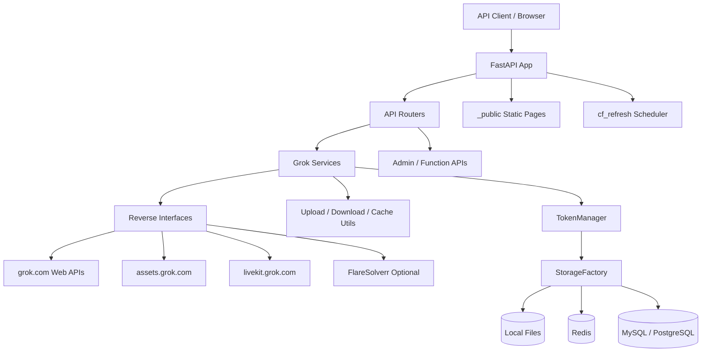

# Grok2API Technical Solution

## 1. 文档目的

本文基于当前仓库代码的静态分析，整理 `grok2api` 的技术方案与实现结构，用于回答以下问题：

- 这个项目的系统目标是什么
- 核心能力是如何分层实现的
- 一次请求如何从 OpenAI 兼容接口落到 Grok Web / Reverse 接口
- 运行时依赖哪些配置、存储、并发与容灾机制
- 当前实现的工程边界、约束与风险在哪里

本文描述的是“当前代码已经落地的方案”，不是重新设计的新系统。

## 2. 项目定位

`grok2api` 是一个基于 FastAPI 的 API 代理与适配层，目标是把 Grok Web 侧能力封装成更统一的接口，主要面向以下场景：

- OpenAI Chat Completions 兼容
- OpenAI Responses API 兼容子集
- 图像生成、图像编辑、视频生成/扩展
- Token 池管理、限额同步、自动刷新
- 管理后台与功能玩法页面

从代码实现看，它不是简单 HTTP 转发器，而是一个“协议适配 + Reverse 接口编排 + Token 运营”的中间层。

## 3. 总体架构

### 3.1 分层说明

| 层次 | 目录 | 责任 |
| :-- | :-- | :-- |
| 入口层 | `main.py` | 应用启动、生命周期、路由注册、中间件、调度器启动 |
| API 层 | `app/api` | OpenAI 兼容接口、管理接口、功能玩法接口、静态页面路由 |
| 核心基础设施层 | `app/core` | 配置、认证、异常、日志、存储、批处理、代理池 |
| 业务编排层 | `app/services/grok` | Chat / Responses / Image / Video / Voice 的业务编排 |
| Token 运营层 | `app/services/token` | Token 池、配额同步、状态迁移、刷新调度 |
| Reverse 接口层 | `app/services/reverse` | 对 Grok Web 端点、WebSocket、资产接口、速率接口的封装 |
| 前端静态资源 | `_public/static` | 管理面板与功能页面 |

## 4. 运行时入口与生命周期

### 4.1 应用启动

启动入口在 `main.py`，应用使用 FastAPI + Granian 运行，且显式禁止 `python main.py` 直启。

启动阶段会执行：

1. 注册默认配置。
2. 从存储加载配置。
3. 初始化日志。
4. 根据配置启动 Token 自动刷新调度器。
5. 根据 `FLARESOLVERR_URL` 与配置启动 `cf_refresh` 后台任务。
6. 注册 API、管理页、功能页和静态资源路由。

### 4.2 生命周期中的后台任务

- Token 刷新调度器：周期性刷新处于 `cooling` 状态的 token。
- cf_clearance 刷新：通过 FlareSolverr 获取 Cloudflare cookies 并回写运行时配置。

### 4.3 中间件与全局处理

- CORS 允许所有来源。
- `ResponseLoggerMiddleware` 为请求生成 TraceID，并记录请求/响应耗时。
- 全局异常处理统一输出 OpenAI 风格错误结构。

## 5. 对外接口设计

### 5.1 OpenAI 兼容 API

| 接口 | 作用 | 实际路由策略 |
| :-- | :-- | :-- |
| `POST /v1/chat/completions` | 统一聊天入口 | 按模型类型分流到 chat / image / image_edit / video |
| `POST /v1/responses` | Responses API 兼容子集 | 先归一化为消息，再复用 ChatService |
| `POST /v1/images/generations` | 图像生成 | 走 WebSocket imagine 流 |
| `POST /v1/images/edits` | 图像编辑 | 先上传参考图，再走 app-chat 图像编辑链路 |
| `POST /v1/videos` | 视频生成 | 兼容 JSON 和 multipart，内部仍走视频服务编排 |
| `POST /v1/video/extend` | 直接视频扩展 | 非 OpenAI 标准接口 |
| `GET /v1/models` | 模型列表 | 返回本地注册模型 |
| `GET /v1/files/*` | 本地缓存文件回源 | 暴露图片/视频缓存 |

### 5.2 管理接口

管理接口挂在 `/v1/admin` 下，主要包括：

- `config`：读取和更新运行时配置
- `tokens`：查看、导入、修改 token
- `tokens/refresh`：批量同步 token 配额
- `cache`：查看本地缓存与在线资产
- `cache/online/clear`：按 token 批量清理在线资产

这部分 API 使用 `app_key` 做认证，页面本身由 `_public/static/admin/*` 提供。

### 5.3 Function 接口与页面

功能玩法接口挂在 `/v1/function` 下，配合 `_public/static/function/*` 页面使用，主要提供：

- 聊天
- imagine WebSocket 持续生成
- 视频 start + SSE
- voice token 获取

`function_enabled` 和 `function_key` 决定这部分是否开放。

## 6. 核心业务链路

### 6.1 Chat Completions 链路

典型链路如下：

1. API 层校验请求格式、角色、工具定义、多模态内容块。
2. `ModelService` 判断模型类型和对应 Token 池策略。
3. `TokenManager` 选择可用 token。
4. `MessageExtractor` 把 OpenAI 消息数组压平成 Grok Web 可接受的单条文本，并抽取附件。
5. `UploadService` 把文件/图片 URL 或 Data URI 上传到 Grok 资产端。
6. `AppChatReverse` 组织 app-chat payload，调用 `https://grok.com/rest/app-chat/conversations/new`。
7. `StreamProcessor` 或 `CollectProcessor` 把 Grok 流式响应转换成 OpenAI 兼容结构。
8. `wrap_stream_with_usage` 或 `token_mgr.consume` 记录 token 消耗。

### 6.2 Tool Calling 方案

这里没有真正执行服务端托管工具，而是做了“提示词模拟 + 结构化解析”：

- 服务端把工具定义注入系统提示。
- 模型按约定输出 `<tool_call>{...}</tool_call>`。
- 服务端解析成 OpenAI 风格的 `tool_calls`。
- 实际工具执行由客户端自行处理并回填。

这意味着它兼容的是“工具调用协议外观”，不是 OpenAI Hosted Tools 的完整执行语义。

### 6.3 Responses API 方案

`/v1/responses` 本质上是一个适配层：

- 把 `input` 归一化为消息数组。
- 把 `web_search` / `file_search` / `code_interpreter` 等内置工具映射成 function tool 外观。
- 复用 `ChatService.completions()`。
- 再把输出重组为 Responses API 对象或 SSE 事件。

因此它的实现优势是复用高，但能力上仍受 Chat Completions 主链路约束。

### 6.4 图像生成链路

图像生成没有走 app-chat 普通文本流，而是走专门的 WebSocket reverse：

1. API 层解析 prompt、size、response_format。
2. `ImageGenerationService` 选择 token，并按需要做跨 token 重试。
3. `ImagineWebSocketReverse` 连接 `wss://grok.com/ws/imagine/listen`。
4. 按 blob 大小区分 `preview` / `medium` / `final` 图像。
5. 若判定被审查或无最终图，触发并行补偿生成。
6. 输出可为：
   - `b64_json`
   - URL（保存到本地缓存后通过 `/v1/files/image/*` 暴露）
   - ChatCompletion 中的 Markdown 图片内容

### 6.5 图像编辑链路

图像编辑使用“上传参考图 + app-chat 图像编辑配置覆盖”的方式：

1. 上传参考图到 Grok 资产服务。
2. 尝试为首张图创建媒体 post，推导 parent post id。
3. 构造 `model_config_override`，指定 `imageEditModelConfig.imageReferences`。
4. 通过 `AppChatReverse` 发起编辑请求。
5. 从结果流中提取最终图片。

### 6.6 视频生成链路

视频服务是项目中编排最复杂的模块之一，关键点如下：

- 文生视频与图生视频都由 `VideoService` 统一处理。
- 先创建 media post，再通过 app-chat 驱动生成。
- 对超过单轮能力的视频时长，会拆成多轮 extension 链式生成。
- 可根据配置决定在单轮后或全部完成后进行 upscale。
- 可选生成 public asset 链接。

视频 token 路由具备业务规则：

- `720p` 或 `video_length > 6` 时优先走 `ssoSuper`
- 否则优先走 `ssoBasic`
- 必要时在池间回退

## 7. Token 池与配额系统

`app/services/token` 是项目的关键基础能力，不只是简单 token 列表。

### 7.1 数据模型

每个 token 维护以下关键信息：

- 状态：`active` / `disabled` / `expired` / `cooling`
- `quota`
- `consumed`
- 使用次数、失败次数、最近同步时间
- 标签、备注、最近资产清理时间

### 7.2 池选择策略

- 基础模型优先 `ssoBasic`，可回退 `ssoSuper`
- Super 模型只走 `ssoSuper`
- 视频模型会结合分辨率和时长做额外路由
- NSFW 图片可优先选带 `nsfw` 标签的 token

### 7.3 状态流转

- 401 失败累计到阈值会转 `expired`
- 429 会标记为 `cooling`
- 定时刷新后可从 `cooling` 恢复为 `active`
- 根据 `windowSizeSeconds` 还能在 `ssoBasic` / `ssoSuper` 池之间迁移

### 7.4 同步与持久化

Token 变更不是每次都立刻全量落盘，而是：

- 记录脏 token
- 合并高频写入
- 优先增量保存
- 通过本地锁 / Redis 锁 / SQL 锁保证多进程安全

这是项目在并发与可用性之间做的一个实际工程折中。

## 8. 配置与存储方案

### 8.1 配置模型

配置源由两部分组成：

- `config.defaults.toml`：默认基线
- 运行时存储中的 `config.toml` 或远端配置

`Config` 组件支持：

- 深度合并默认值与运行时值
- 旧配置键自动迁移
- 非法配置节自动裁剪
- 后端为空时从本地配置引导初始化

### 8.2 存储后端

系统通过 `StorageFactory` 抽象出三类存储：

| 存储类型 | 说明 |
| :-- | :-- |
| Local | 本地 `config.toml` + `token.json` |
| Redis | Hash/Set 扁平化存储配置与 token |
| SQL | MySQL / PostgreSQL，带 schema 初始化和分布式锁 |

### 8.3 本地运行目录

默认会在 `DATA_DIR` 下维护：

- `config.toml`
- `token.json`
- `tmp/image`
- `tmp/video`
- `.locks`

Docker 入口脚本会确保这些目录和文件存在。

## 9. Reverse 接口与容错机制

### 9.1 Reverse 层职责

`app/services/reverse` 封装了对 Grok Web 生态接口的直接访问，包括：

- app-chat
- imagine WebSocket
- 资产上传/查询/删除
- 速率限制查询
- video upscale
- NSFW 开启
- LiveKit token 获取

业务层不直接拼接底层 HTTP 请求，而是通过这层隔离。

### 9.2 会话与重试

关键容错机制包括：

- `ResettableSession`：指定状态码后自动重建会话
- `retry_on_status`：基于状态码、退避预算与 `Retry-After` 做重试
- `proxy_pool`：支持多个代理地址，按 403/429/502 轮转
- token 级重试：同一请求失败后可切到其他 token 再试

一个重要实现细节是：

- app-chat 的 429 不做同 token HTTP 重试，而是交给 token 层换号处理

这说明项目把“上游短暂抖动”和“token 本身限额”区分开了。

## 10. Cloudflare 与代理方案

项目支持两种网络保障方式：

### 10.1 代理

- `proxy.base_proxy_url`：Grok 主接口代理
- `proxy.asset_proxy_url`：资产代理
- 支持多个代理地址逗号分隔
- 支持代理 SSL 校验跳过

### 10.2 cf_clearance 自动刷新

当 Cloudflare 挑战成为访问前提时，可启用：

1. FlareSolverr 访问 `grok.com`
2. 获取 cookies、`cf_clearance`、`user_agent`
3. 回写到运行时配置
4. 定时循环刷新

这部分是保证 reverse 方案可持续运行的重要辅助能力。

## 11. 缓存、静态资源与文件回源

### 11.1 本地媒体缓存

项目会把图片/视频缓存到本地目录：

- 图片：`DATA_DIR/tmp/image`
- 视频：`DATA_DIR/tmp/video`

当响应格式选择 URL 时，服务端会先落盘，再通过 `/v1/files/*` 暴露。

### 11.2 后台与功能页面

前端采用静态页面方式交付，没有独立前端构建链：

- 管理页面：`_public/static/admin/*`
- 功能页面：`_public/static/function/*`
- 公共脚本与国际化资源：`_public/static/common/*`、`_public/static/i18n/*`

这种方案部署简单，但前后端边界也更耦合于同一个仓库。

## 12. 部署方案

### 12.1 本地与容器

- 本地开发：`uv sync` + `granian main:app`
- 容器部署：多阶段 Docker 构建，运行时镜像较轻
- Docker Compose：支持数据卷、日志卷、可选 Warp / FlareSolverr

### 12.2 Serverless / PaaS

- Render：通过 Docker 部署
- Vercel：依赖 `/tmp/data`，需关闭文件日志

### 12.3 健康检查

项目提供 `/health` 供平台或保活服务调用。

## 13. 安全与鉴权

当前鉴权方案包括三套密钥：

- `app.api_key`：OpenAI 兼容 API
- `app.app_key`：后台管理
- `app.function_key`：功能玩法接口

实现特点：

- Bearer Token 认证
- 使用 `hmac.compare_digest` 做常量时间比较
- 支持多个 API key
- 错误输出统一转成 OpenAI 风格

需要注意：

- CORS 当前对所有来源开放
- 管理页面是静态可访问的，真正保护的是后台 API

## 14. 当前工程判断

### 14.1 方案优势

- 目标清晰：围绕 Grok Web 能力做统一 API 出口
- 兼容层完整：Chat / Responses / Images / Videos 都有覆盖
- Token 运营能力较强：选号、迁移、刷新、同步、批处理都已成体系
- 存储抽象完整：本地、Redis、SQL 三套后端均可运行
- Reverse 容错较实用：代理轮换、会话重建、状态码退避、跨 token 重试
- 交付闭环完整：API、后台、功能页、部署脚本在同一仓库中

### 14.2 约束与风险

1. 该项目高度依赖 Grok Web 侧 reverse 协议，接口变更会直接影响主链路稳定性。
2. `/v1/responses` 与 tool calling 属于兼容外观实现，不等价于 OpenAI 官方托管工具语义。
3. 功能玩法的 session、批处理任务等状态主要保存在进程内内存，多实例下天然不共享。
4. 当前仓库未发现自动化测试用例，回归保障主要依赖运行时验证。
5. 视频、图像、聊天三个主服务文件较重，编排逻辑集中，后续维护成本会偏高。
6. 静态前端与服务端同仓耦合，适合一体部署，但不利于独立前端演进。
7. 目录中存在未接入主运行时的痕迹目录，如 `app/mcp_search`，说明仓库内可能有预留或历史残留结构。

## 15. 结论

从当前实现看，`grok2api` 的技术方案可以概括为：

“以 FastAPI 为承载，以 Token 池和配置中心为基础设施，以 Reverse 接口封装为底座，将 Grok Web 的聊天、图像、视频、语音能力适配成 OpenAI 风格 API，并通过管理后台与功能页面补齐运维与操作闭环。”

它的核心竞争力不在通用 Web 框架本身，而在以下三点：

- OpenAI 协议适配能力
- Token 池运营与可用性保障
- 对 Grok Web 能力链路的深入编排

如果把项目当作产品系统来看，它已经具备“可部署、可运营、可兼容”的完整形态；如果把它当作基础平台来看，后续稳定性主要取决于 reverse 协议变化、测试补齐程度，以及内存态功能在多实例环境中的治理方式。
